# 메이즈 위스커스 게임물내용설명서

### 2026년 9월 22일 내용 교정본

현재 게임의 규칙과 표현을 설명합니다. 기존 설명서의 회복 조건, 추격 방식, 종료 연출, 화면 효과 및 숨은 실행 경로를 실제 소스에 맞춰 보완했습니다.

검토 상태: 제출 전 검토용. 기존 삽입 화면의 촬영 버전은 확인되지 않았으며, 토스 전용 기능의 실기기 영상과 GRAC 제출 형식 확인이 남아 있습니다. 게임명·상호 표기는 접수 전 증빙과 대조해야 합니다.

| 신청인(상호) | 요철 |
|---|---|
| 대표자 | 이중민 |
| 배급자 | 요철 |
| 유통처 | 앱인토스(토스 앱 미니앱) |
| 작성일 | 2026년 9월 22일 |

대상 버전 0.1.0 / 소스 c7533e4 / 웹 실행본 기준. 계정 및 인증 정보는 포함하지 않습니다.

## 1. 게임 개요

| 게임물명 | Mazewhiskers(메이즈 위스커스) |
|---|---|
| 장르 | 캐주얼 액션 (2D 탑다운 미로 탈출) |
| 플랫폼 | 모바일 게임 — 토스 앱 미니앱(HTML5, WebView) |
| 이용 방식 | 1인 플레이. 인터넷 접속 필요(게임 파일과 순위표). 다른 이용자와 직접 대결·대화 없음 |
| 이용 요금 | 무료. 인앱 결제, 확률형 아이템, 유료 재화 없음. 판과 판 사이에 광고가 나옵니다(5. 게임 시스템 참고). |
| 희망 등급 | 전체이용가 |
| 개발 연도 | 2024년 개발 시작 |
| 언어 | 한국어(설정에서 영어 선택 가능) |

### 게임물 개요

Mazewhiskers(메이즈 위스커스)는 재개발이 진행되는 미로 도시에서 길고양이가 도시 중앙의 목적지까지 탈출하는 2D 탑다운 캐주얼 액션 게임입니다. 플레이어는 화면의 가상 조이스틱으로 고양이를 움직여 골목을 탐색하고, 생선과 우유를 모아 체력과 점수를 얻습니다. 일정 시간마다 ‘월세’로 체력이 줄고, 공사 경고선이 표시된 자리에는 아파트 건물이 올라와 길을 막습니다. 적 역할의 검은 고양이가 플레이어를 추격하며, 닿으면 플레이어가 튕겨 나가고 체력이 줄어듭니다(피나 신체 훼손 표현은 없습니다). 체력이 모두 떨어지거나 건물 사이에 갇히면 게임이 끝납니다. 난이도는 이지·노말·하드·나이트메어 네 단계이며, 나이트메어에서는 시야가 좁아지고 보라색 화면 왜곡과 글리치 효과, 변조된 배경음악으로 긴장감을 연출합니다. 결제, 확률형 아이템, 채팅 기능은 없습니다. 판과 판 사이에 광고가 나오며, 점수는 토스 게임센터 순위표에 기록됩니다.

## 2. 줄거리

오래된 골목들이 얽힌 도시. 길고양이 한 마리가 도시 한가운데 있는 자기 집으로 돌아가려 합니다.

그 사이 도시에는 재개발이 시작됩니다. 공사 경고선이 그어진 자리마다 고층 아파트가 들어서며 골목이 하나씩 사라지고, 고양이가 설 자리도 줄어듭니다. 월세와 생활비는 가만히 있어도 빠져나가고, 검은 고양이는 “월세나 내라옹”, “보증금 5억이다냥” 같은 말로 놀리며 뒤를 쫓습니다.

플레이어는 길이 모두 막히기 전에 집에 도착해야 합니다. 도착하면 엔딩 문구가 흐르고, 실패하면 무엇 때문에 끝났는지(월세, 붙잡힘, 밀려남, 갇힘 등)가 결과 화면에 표시됩니다. 게임은 청년 세대의 주거 문제를 길고양이의 시점으로 은유합니다.

## 3. 주요 캐릭터

| 캐릭터 | 설명 |
|---|---|
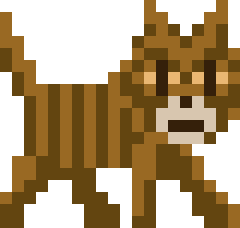

| 고양이 (플레이어) | 플레이어가 조작하는 줄무늬 길고양이. 머리 위에 체력 막대와 점프 가능 횟수가 표시됩니다. / 가끔 혼잣말을 합니다(“월세가 또 올랐대”, “집이 있으면 좋겠다” 등). 주요 대사는 부록에 있습니다. |
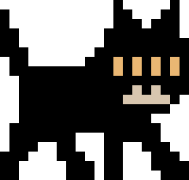

| 검은 고양이 (적) | 등장 예고 후 플레이어를 지속적으로 추격합니다. 시야에서 벗어나도 추격을 포기하지 않습니다. 난이도가 높을수록 추격 속도와 표시되는 시야 원뿔 범위가 커지고, 하드 이상에서는 더 넓은 건물도 뛰어넘을 수 있습니다. / 닿으면 플레이어가 튕겨 나가고 기본 모드에서 체력이 35 줄어듭니다(별도 아케이드 경로에서는 50). 맞은 뒤 1.5초 동안은 다시 피해를 받지 않습니다. 공격 동작, 무기, 피, 신체 훼손 표현은 없습니다. |

## 4. 아이템과 오브젝트

| 대상 | 설명 |
|---|---|
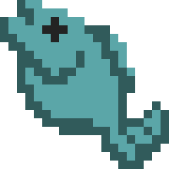

| 생선 | 체력 +20, 점수 +100. 공사 예고 구역에 놓인 생선은 체력을 +35 회복합니다. 회복량은 체력의 낮고 높음으로 결정되지 않으며, 최대 체력은 100입니다. |
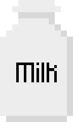

| 우유 | 마시면 점프를 한 번 할 수 있습니다. 점프하면 벽이나 건물 한 칸을 뛰어넘습니다. 점수 +50, 점프할 때마다 +10. |
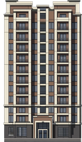

| 아파트 | 재개발로 들어서는 고층 건물. 노란 공사 경고선이 먼저 표시되고 잠시 뒤 올라옵니다. 올라오는 자리에 있던 고양이는 옆으로 밀려나며, 밀려날 곳이 없으면 게임이 끝납니다. 들어선 아파트는 길을 막습니다. |
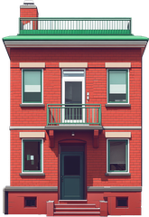

| 집(목적지) | 도시 한가운데 있는 목적지. 노란 화살표가 늘 방향을 가리킵니다. 도착하면 클리어입니다. |

## 5. 게임 시스템

### 체력과 월세

체력은 100에서 시작합니다. 조작 가능한 플레이 중에는 이지 기준 1초마다 1씩 줄며, 다른 난이도에서는 비용 배율을 적용합니다. 일시정지·대화 연출 중에는 이 감소를 적용하지 않습니다.

30초마다 ‘월세’로 12가 한 번에 빠집니다(5초 전부터 경고). 난이도가 높을수록 이 비용이 커집니다.

생선을 먹으면 회복합니다. 체력이 0이 되면 게임이 끝납니다.

### 재개발

게임이 진행될수록 도시 곳곳에 공사 경고선이 표시되고 그 자리에 아파트가 들어섭니다.

화면 오른쪽 위 미니맵 아래에 “남은 골목” 비율이 표시됩니다.

목적지까지 가는 길이 모두 막히거나, 목적지 자체에 아파트가 들어서면 게임이 끝납니다.

### 추격

검은 고양이는 등장 예고 후 계속 추격합니다. 장애물이 있으면 길을 찾거나 점프하며, 시야에서 벗어났다는 이유로 수색을 끝내거나 순찰로 돌아가지 않습니다.

적이 가까워지면 화면 가장자리가 붉게 물들고 배경음악이 빨라져 위험을 알립니다.

### 난이도

| 난이도 | 차이 |
|---|---|
| 이지 | 기본 규칙. 처음 플레이하면 튜토리얼이 나옵니다. |
| 노말 | 생활비·월세 배율 1.3. 재개발이 빨라지고 적의 추격 속도와 표시 시야 범위가 커집니다. |
| 하드 | 생활비·월세 배율 1.75. 재개발과 추격이 더 빨라지며, 적이 더 넓은 건물을 뛰어넘을 수 있습니다. |
| 나이트메어 | 생활비·월세 배율 1.95. 기본 도시의 한 변이 약 1.5배이며(41칸에서 61칸, 별도 크기가 정해진 오늘의 도시는 예외), 시야가 좁아져 가 본 골목만 보입니다. 화면이 보라색으로 물들고 일렁이며, 가끔 화면이 찢어지는 듯한 글리치 효과가 나옵니다. 배경음악은 느리고 낮게 변조됩니다. 튜토리얼 대신 “설명 같은 건 없어. 할 수 있으면 해보든가~ 캬캬캬” 한 줄이 나옵니다. |

적 접근 시 붉은 화면의 맥동 주파수 설정은 최대 2.6Hz입니다. 화면이 찢어지는 글리치는 별도 효과이며 적이 가까울수록 발생 간격이 짧아집니다. 이 수치를 글리치 전체의 깜빡임 제한이나 광과민성 안전성 검증 결과로 해석하지 않습니다.

### 빙판

일부 골목이 얼어 있습니다. 빙판 칸에 들어서면 고양이가 들어간 방향으로 계속 미끄러지며, 빙판이 끝나는 칸에서 멈춥니다. 벽이나 아파트에 닿아도 멈춥니다.

미끄러지는 동안에는 조작이 반영되지 않습니다. 점프(우유)를 쓰면 빠져나올 수 있습니다. 빙판 자체가 별도 피해를 주지는 않습니다. 미끄러지는 동안에도 생활비·월세, 적과의 접촉 및 재개발에 따른 종료 조건은 적용됩니다.

적 캐릭터(검은 고양이)도 같은 방식으로 미끄러집니다.

빙판은 무작위로 나옵니다. 일반 플레이에서는 네 판 중 한 판 정도의 도시에 골목의 8~22%를 목표 비율로 얼리며 실제 배치는 구간 생성 및 보호 구역에 따라 달라집니다. ‘오늘의 도시’에는 빙판 없음, 목표 비율 10%·30%·55%, 긴 직선을 얼리는 결빙 대로 유형이 있습니다. 시작 지점과 목적지 주변은 얼지 않습니다.

### 오늘의 도시

메뉴의 “오늘의 도시”를 고르면 한국 날짜를 기준으로 같은 도시 종류와 시드가 정해집니다. 같은 난이도·모드에서는 초기 배치가 재현되지만, 난이도에 따라 도시 크기가 달라질 수 있고 이후 아파트 배치는 플레이 경로에 따라 달라집니다. 규칙과 점수 계산은 일반 플레이와 같고, 점수는 같은 순위표에 기록됩니다.

도시 종류는 20종이며 20일 단위로 순서를 섞어 하루에 하나씩 제공합니다. 같은 종류도 날짜 시드에 따라 배치가 달라집니다.

오늘의 최고 점수와 연속으로 플레이한 일수가 기기에 저장되어 메뉴에 표시됩니다. 출석 보상이나 재화 지급은 없습니다.

### 엔딩 도감

게임이 끝나는 8가지 경우(집 도착 1가지, 게임 오버 7가지) 중 이용자가 본 것을 목록으로 보여 줍니다. 아직 보지 못한 항목은 “？？？”로 가려집니다. 수집에 따른 보상은 없습니다.

### 설정

소리, 메뉴·패널의 화면 테마(어둡게/밝게), 언어(한국어/영어), 난이도, 진동 켜기/끄기, 화면 효과 줄이기. 밝은 테마는 게임 세계의 어둠을 제거하는 기능이 아닙니다.

“화면 효과 줄이기”를 켜면 화면 흔들림이 1/4로 줄고, 글리치(화면 찢김) 효과가 나오지 않으며, 적이 가까울 때의 붉은 화면이 깜빡이지 않고 고정됩니다. 기기의 “동작 줄이기” 설정이 켜져 있으면 자동으로 적용됩니다.

### 광고

플레이 중에는 광고가 나오지 않습니다. 광고는 결과 화면에서만, 두 가지 방식으로 나옵니다.

전면 광고: 결과 화면에서 “다시” 또는 “메뉴로”를 눌러 나갈 때 나올 수 있습니다. 접속 후 첫 판 뒤에는 나오지 않고, 직전 광고로부터 150초가 지나야 다시 나옵니다.

보상형 광고: 결과 화면의 “광고 보고 우유 한 팩 들고 시작” 버튼을 이용자가 직접 눌렀을 때만 나옵니다. 광고 SDK에서 보상 획득 이벤트를 받은 경우 다음 판을 점프 2회(기본 1회)로 시작합니다. 광고를 닫기만 했거나 로드에 실패한 경우에는 보상을 지급하지 않습니다. 보상은 게임 내 점프 1회뿐이며 현금·경품·유료 재화와 무관합니다.

광고는 토스의 인앱 광고 SDK를 통해 요청합니다. 광고 소재는 게임 코드에 포함되어 있지 않습니다. 보상형 광고 표시 직후에는 전면 광고 간격을 다시 계산해 연속 노출을 피하며, 준비된 광고가 없으면 전면 광고 없이 다음 화면으로 이동합니다.

## 6. 조작 방법

| 입력 | 동작 |
|---|---|
| 왼쪽 아래 가상 조이스틱 | 고양이 이동 |
| 오른쪽 아래 JUMP 버튼 | 점프(우유로 얻은 횟수만큼) |
| 오른쪽 위 메뉴 버튼 | 일시정지, 소리·화면·언어 설정, 다시 시작, 메뉴로 |
| 대화 상자 터치 | 튜토리얼 대사 넘기기 |
| (PC 브라우저) 방향키 / 스페이스 | 이동 / 점프 |

## 7. 진행 흐름과 주요 장면

메인 메뉴 → 게임 시작 → (처음 한 번) 튜토리얼 → 플레이 → 도착 또는 종료 → 결과 화면

튜토리얼은 이동, 목적지, 생선, 우유, 재개발(경고선과 아파트), 체력, 적 등장 순서로 안내합니다.

## 주요 장면 참고 화면

다음 화면은 기존 DOCX에 포함된 이미지를 유지한 것입니다. 현재 실행본과 동일 버전에서 재촬영한 증거로 사용하지 않습니다.

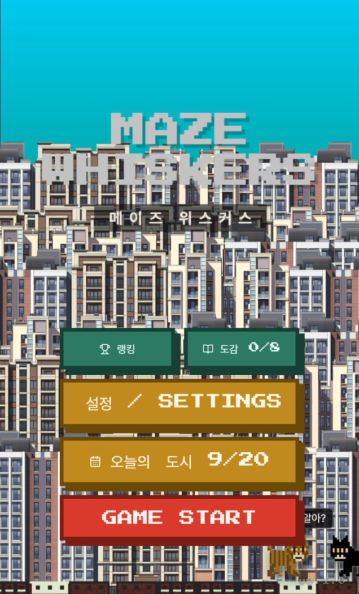

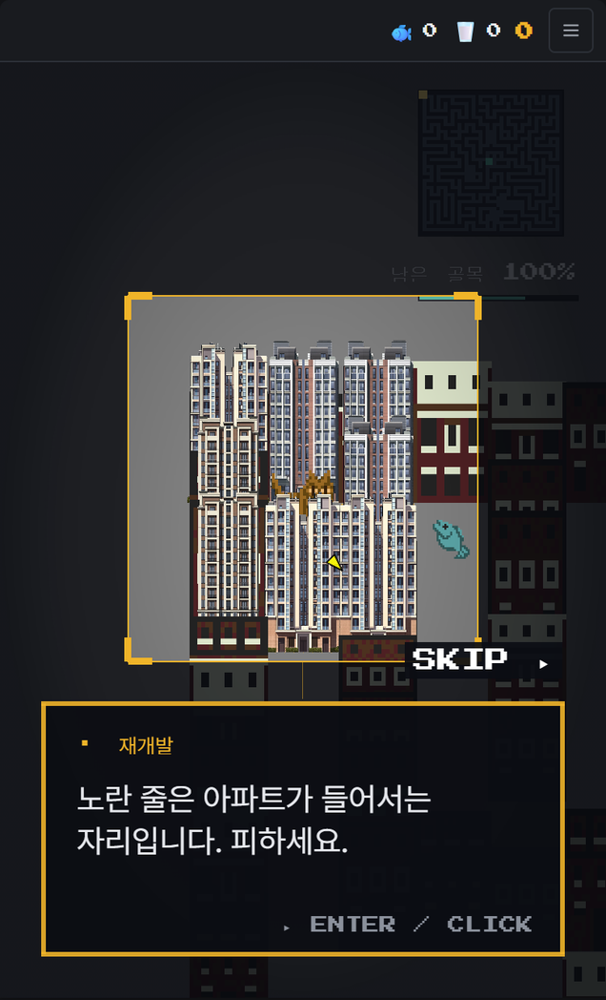

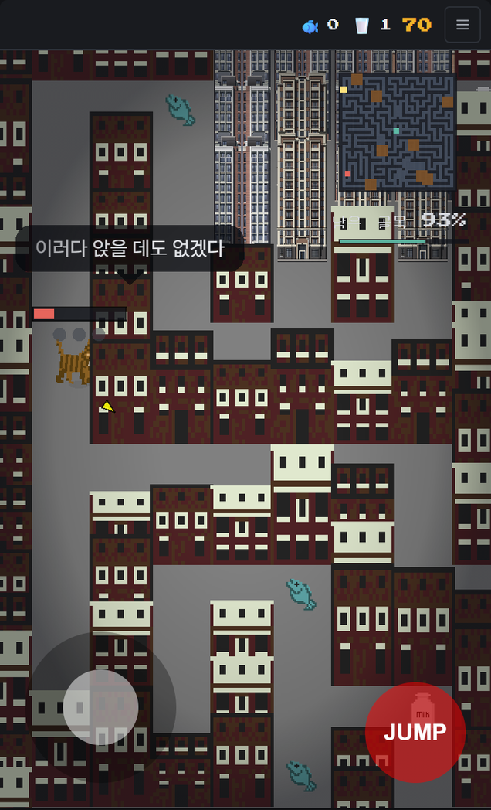

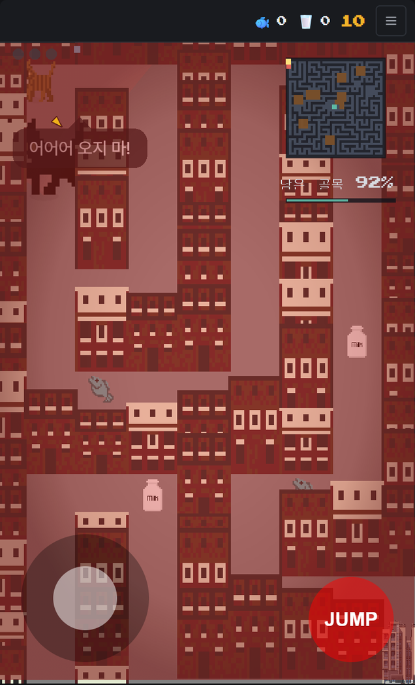

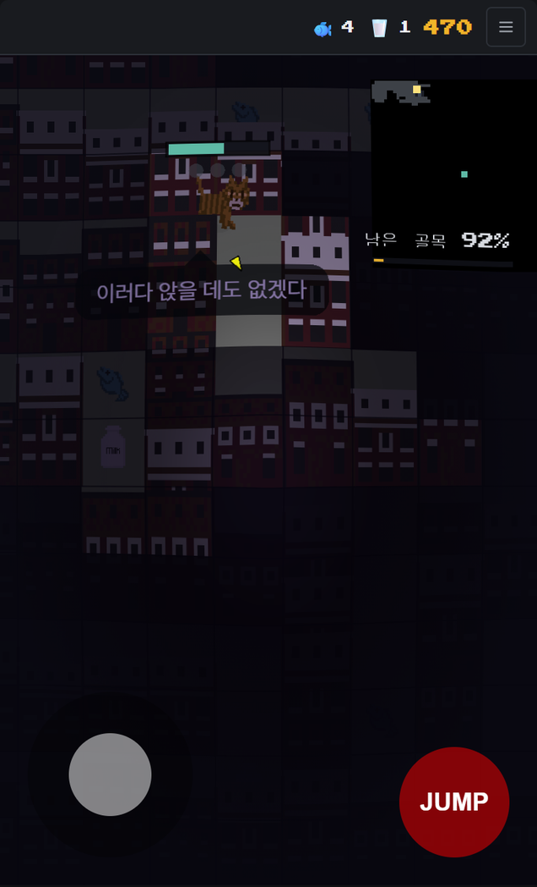

## 8. 게임이 끝나는 조건

| 조건 | 결과 화면 제목 | 결과 화면 문구 |
|---|---|---|
| 체력 0 | 버티지 못했다 | 월세와 생활비가 남은 것을 다 가져갔습니다. 생선은 모아 둘 수 없습니다. |
| 검은 고양이에게 닿아 체력 0 | 붙잡혔다 | 버틸 수 있는 만큼은 버텼습니다. 그 다음은 없었습니다. |
| 아파트에 밀려날 곳이 없음 | 밀려날 곳이 없었다 | 짓눌린 것이 아닙니다. 밀려나고 또 밀려나다, 물러설 자리가 사라졌을 뿐입니다. |
| 목적지에 아파트가 들어섬 | 집이 먼저 사라졌다 | 도착하기 전에 그 자리에 아파트가 들어섰습니다. |
| 사방이 막힘 | 갈 곳이 없었다 | 사방이 막혔습니다. 체력이 남아 있어도 나갈 길이 없으면 끝난 것입니다. |
| 목적지로 가는 길이 모두 막힘 | 길이 끊겼다 | 집은 아직 저기 있습니다. 다만 거기까지 가는 길이 모두 아파트가 되었습니다. |
| 오래 움직이지 않음 | 움직이지 않았다 | 가만히 서 있는 동안에도 월세는 나갔습니다. 도시는 기다려 주지 않습니다. |
| 목적지 도착(클리어) | 집에 닿았다 | 도시가 먼저 도착하지 못했습니다. 이번에는. (이후 엔딩 문구가 흐름) |

## 9. 점수와 순위

모은 점수: 우유 50점, 생선 100점, 점프 1회 10점.

순위 점수: (모은 점수 + 도착 시 1,000점 + 기준 시간(이지·노말·하드 120초, 나이트메어 180초)보다 빨리 도착한 1초당 10점) × 난이도 가중치(이지 1.0, 노말 1.3, 하드 1.7, 나이트메어 2.3). 결과 화면에 내역이 표시됩니다.

순위 점수는 토스 게임센터 순위표에 기록됩니다. 다른 이용자와 직접 겨루는 대전, 채팅, 아이템 교환은 없습니다.

경품, 현금성 보상, 유료 재화, 확률형 아이템은 없습니다. 보상형 광고의 보상은 다음 판의 점프 1회입니다.

## 10. 내용정보 관련 사항

| 항목 | 해당 여부 | 내용 |
|---|---|---|
| 폭력성 | 있음(경미) | 검은 고양이(동물 캐릭터)에게 닿으면 플레이어 캐릭터가 튕겨 나가고 화면이 흔들리며 체력이 줄어듭니다. 종료 시 바닥에 검은 구멍이 열리고 고양이가 뒤집히며 작아져 구멍 속으로 사라지는 만화식 연출이 있습니다. 무기, 공격 동작, 피, 신체 훼손 표현은 없습니다. |
| 공포 | 있음 | 나이트메어 난이도에서 어두운 시야, 보라색 화면 왜곡과 일렁임, 글리치 효과, 낮게 변조된 배경음악, 적이 가까워지면 붉어지는 화면으로 긴장감을 연출합니다. 괴물, 시체, 혐오스러운 이미지는 없습니다. |
| 언어 | 있음(경미) | 비속어·욕설 글자는 없습니다. 캐릭터가 놀라거나 맞을 때 욕설을 기호로 가린 만화식 표현 4종이 말풍선으로 나옵니다: “아오 %$#%!”, “$@#^%#&*!”, “@#$%! 저리 가!”, “#$%@!”. 검은 고양이의 놀림 대사(“월세나 내라옹”, “보증금 5억이다냥” 등)는 비속어를 포함하지 않습니다. |
| 선정성 | 없음 | — |
| 사행성 | 없음 | 결제, 도박 모사, 확률형 아이템, 재화 거래 없음. 광고 보상은 게임 내 점프 1회로, 환전·거래할 수 없습니다. |
| 약물 | 없음 | — |
| 범죄 | 없음 | — |

## 부록. 대사 목록

아래는 주요 한국어 대사와 엔딩 문구입니다. 영어에도 기호 욕설 표현이 존재하며, 언어별 실제 문구는 별첨 한국어 영어 문구 대조표에서 확인할 수 있습니다. 메뉴·도시 설명·기록 안내를 포함한 모든 문구를 이 부록에 실었다는 뜻은 아닙니다.

### 튜토리얼 (처음 한 번)

| 말하는 쪽 | 대사 |
|---|---|
| 이동 | 당신은 길고양이입니다. 왼쪽 아래 스틱으로 골목을 걸어 다닐 수 있습니다. |
| 집 | 저기 도시 한가운데가 당신의 집입니다. 노란 화살표가 늘 그쪽을 가리킵니다. |
| 생선 | 생선은 체력을 채워 줍니다. 모아 둘 수는 없고, 계속 구해야 합니다. |
| 우유 | 우유를 마시면 방향대로 점프할 수 있습니다. |
| 재개발 | 노란 줄은 아파트가 들어서는 자리입니다. 피하세요. |
| 체력 | 체력은 가만히 있어도 줄어듭니다. 머리 위 막대가 당신에게 남은 시간입니다. |
| ? (검은 고양이 첫 등장) | 인생은 뜻하지 않은 위기가 도사리지 캬캬 |
| 시작 | 자, 이제 집까지 가세요! |
| 어둠 속에서 | 설명 같은 건 없어. 할 수 있으면 해보든가~ 캬캬캬 (나이트메어, 튜토리얼 대신) |

### 플레이 중 말풍선

| 상황 | 대사 |
|---|---|
| 첫 아파트가 들어설 때 (고양이) | 재개발이 시작되는구나! |
| 아파트가 들어설 때 (고양이) | 또 하나 올라갔어... / 여기도 아파트야? / 내 골목 내놔! / 어? 길이 없어졌잖아 / 아니 저기 내 자리인데 / 이러다 앉을 데도 없겠다 |
| 쫓길 때 (고양이) | 살려줘! 도망가! / 아오 %$#%! / $@#^%#&*! / 왜 나만 쫓아와! / 헉헉... 안 돼! / @#$%! 저리 가! / 어어어 오지 마! |
| 맞았을 때 (고양이) | 아야! / #$%@! / 아 진짜! |
| 혼잣말 (고양이) | 여긴 또 어디야... / 월세가 또 올랐대 / 집이 있으면 좋겠다 / 보증금이 뭔데 그렇게 비싸 / 배고파... / 다리 아파 / 이 골목 아까 왔는데? / 내 방 한 칸이면 되는데 / 따뜻한 데서 자고 싶다 / 여기 원래 우리 동네였는데 |
| 놀림 (검은 고양이) | 캬캬캬 / 어디 가시나~ / 집은 있고? / 월세나 내라옹 / 거기 서라옹 / 보증금 5억이다냥 / 재개발은 못 참지 / 도망가봐야 소용없다냥 / 여긴 이제 내 구역이다 |

### 메인 메뉴의 두 고양이

| 장면 | 대사 |
|---|---|
| 혼잣말 | 야옹~ / 캬캬캬 / 또 왔네? / 이 동네 내 구역인데 / 오늘은 조용하네 / 배고프다... |
| 만났을 때 | 어이, 또 너야? / 여기 내 자리거든? / 캬캬캬, 곧 아닐걸 / 저 위에 아파트 또 생긴대 / 나쁠 거 있나. 난 지붕이 좋아 / 집에 가는 길 알아? / 알지. 안 알려줄 뿐이야 / 치사해 |
| 쫓길 때 (고양이) | 으악! / 아 왜 또! / 살려! |
| 쫓을 때 (검은 고양이) | 캬캬캬캬 / 거기 서! / 어디 가~ |
| 도망친 뒤 | 하아... 하아... / 심장 떨어질 뻔 |

### 결과 화면의 검은 고양이

| 장면 | 대사 |
|---|---|
| 놀림 | 겨우 그거야? 캬캬캬 / 집이 저기 있는데 말이지~ / 야옹~ 다음엔 좀 더 빨리 뛰어 / 내 자리 앉아도 되지? / 한 번 더 해봐. 기다려 줄게 |

### 엔딩 문구 (도착 후)

| Life begins without a rehearsal. — 인생은 리허설 없이 시작된다. |
|---|
| Using the rough waves of anxiety as our drive — 불안이라는 거친 파도를 동력 삼아 |
| we simply plunge toward an unknown point. — 우리는 그저 미지의 점을 향해 뛰어든다. |
| Even if I were to open my eyes again, — 내가 다시 눈을 뜬다 해도, |
| my choice remains the repetition of this very life. — 나의 선택은 바로 이 삶의 반복이다. |

## 추가 설명 현재 포함된 아케이드 경로

기본 메뉴에는 모드 선택 버튼이 없지만, 현재 웹 실행본은 주소에 ?mode=arcade를 붙이면 아케이드 규칙을 사용합니다. 이 경로는 출시 빌드에서도 차단되지 않습니다. 네 가지 난이도 및 오늘의 도시와는 별도의 실행 모드입니다.

기본 경로는 1구역, 적 1마리, 접촉 피해 35, 대시 비활성입니다. 아케이드 경로는 3구역을 이어 진행하고 구역마다 적이 1마리씩 늘며, 접촉 피해는 50입니다. 재개발이 기본 모드보다 빠르고 구역을 진행할수록 압박이 커집니다.

아케이드에서는 Shift 키 또는 DASH 버튼으로 짧게 돌진합니다. 재사용 대기시간과 짧은 무적 시간이 있으며 점프 재화는 소비하지 않습니다. 판 전체를 클리어하려면 마지막 구역까지 도착해야 합니다.

현재 포함된 경로를 설명한 것이며, 실제 토스 출시 진입 주소와 이 경로의 포함 여부는 출시 담당자가 확정해야 합니다. 제거할 경우에는 코드·실행본·설명서·촬영본을 함께 갱신해야 합니다.

## 실행 환경 및 토스 전용 기능

본 게임은 토스 앱 내 WebView에서 실행되는 HTML5 게임입니다. 별도 APK 또는 IPA 설치 파일 대신 같은 소스로 만든 브라우저 실행본을 검토용으로 준비했습니다. 정적 웹 서버의 루트에서 제공해야 하며 index.html을 직접 더블클릭하는 방식은 지원하지 않습니다.

일반 브라우저에서는 토스 게임센터 순위표, 사용자 식별키, 진동 및 실제 광고 SDK 호출이 제공되지 않습니다. 개인 기록은 브라우저 저장소로 처리됩니다. 토스판의 사용자 식별키는 로컬 기록 저장 위치를 구분하며, 점수는 토스 게임센터 API로 전달합니다.

브라우저판에 광고가 보이지 않는다고 광고 없는 게임으로 신고하지 않습니다. 광고 보상과 토스 순위표는 토스 앱에서 촬영한 영상으로 추가 입증합니다. 새 실행본은 시뮬레이터 광고를 활성화하지 않은 production 빌드입니다.

## 영어 설정의 기호 욕설

한국어: 살려줘! 도망가! / 아오 %$#%! / $@#^%#&*! / 왜 나만 쫓아와! / 헉헉... 안 돼! / @#$%! 저리 가! / 어어어 오지 마!

영어: Help! Run! / Ah %$#%! / $@#^%#&*! / Why is it always me! / Nope nope nope! / @#$%! Get away! / No no no don't!

한국어: 아야! / #$%@! / 아 진짜!

영어: Ow! / #$%@! / Oh come on!

영어에서도 Ah %$#%!, $@#^%#&*!, @#$%! Get away!, #$%@!가 표시됩니다. 한국어만 검토해 언어 표현이 없다고 판단하지 않습니다.

### 별첨 문구 대조표 범위

한국어 170개 항목, 영어 170개 항목, 도시 종류 20종의 이름·설명, 크레딧 문자열을 소스에서 추출했습니다. 주요 대사 외 UI 문구도 함께 대조할 수 있습니다. 다른 파일에 하드코딩된 모든 문자열의 전수 수집을 의미하지는 않습니다.
